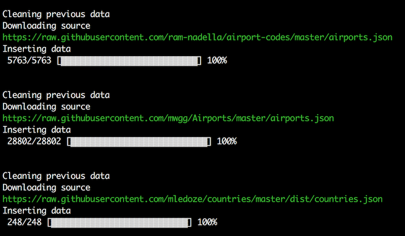
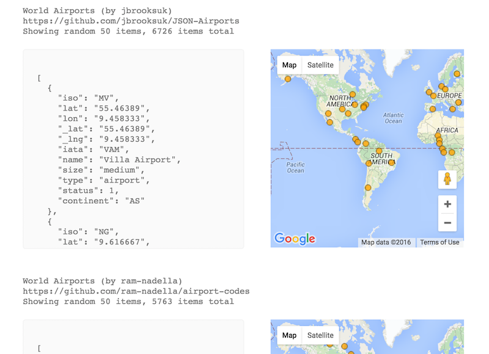

## About

Magalhaes in Trip.ee data processing and analysis framework.

## Installation

```sh
brew install php70
brew install mysql
mysqladmin -uroot create magalhaes
git clone https://github.com/tripikad/magalhaes
cd magalhaes
composer install
cp .env.example .env
# edit database credentials in .env
php artisan migrate
php artisan source:all
```

## Architecture

The data pipeline has three stages: **source** data, optional **processed** data and **target** data.

### Source data

#### Storage

Source data is **schemaless**, unstructured, unprocessed data that is not meant for direct production usage.

Source data is stored in SQL database in unstructured JSON format. By default the data stored in ```source``` table in following schema:

||id|sourcename|value|
|---|---|---|---|
|Type|increments|string|json|
|Comment||Matches ```*sourcename*``` above |Data dumpster|
|Sample row|```234```|```world_airports```|```{"code": "TLL", "name": "Tallinn Airport"}```|
|Sample row|```235```|```world_airports```|```{"code": "FRA", "name": "Frankfurt Airport"}```|
|Sample row|```236```|```geonames_countries```|```{"name": "Estonia", "isocode": "EE"}```|

There might be a need for dedicated tables for certain source data. The convention is to use ```source_*sourcename*``` table with similar key-value JSON storage.

#### Fetching



Source datasets are fetched and stored in ```app/Console/Commands/Source*sourcename*``` commands and executed via:

```
php artisan source:*sourcename*
```

You can fetch and store all data sources in one go using:

```
php artisan source:all
```

Generally source data is not processed in any way, there is one exception: the data fetchers could add ```_lat```, ```_lng``` and ```_polygon``` keys to the JSON column for data preview.

#### Preview



Source data can be previewed in ```/sources/index.html``` page. 

### Processed data (optional)

There might be a need for intermediate step between source and target data for analysis and data cleanup. Processed data might have a **schema**, such as geoindexes.

Naming convention: ```processed_*processedname*```.

### Target data

Target data is meant for direct consumption via API. It has **schema** and most likely have Eloquent models attached to them.

Naming convention: ```target_*targetname*```.
